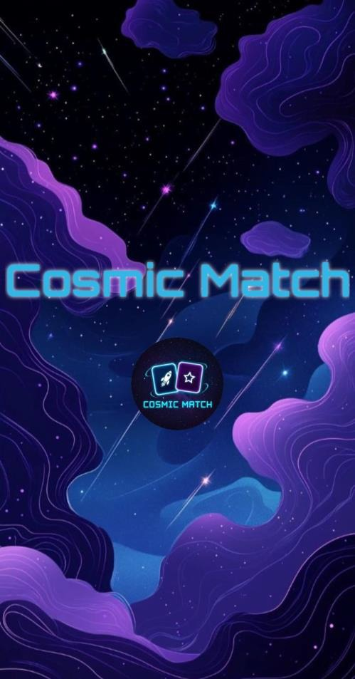
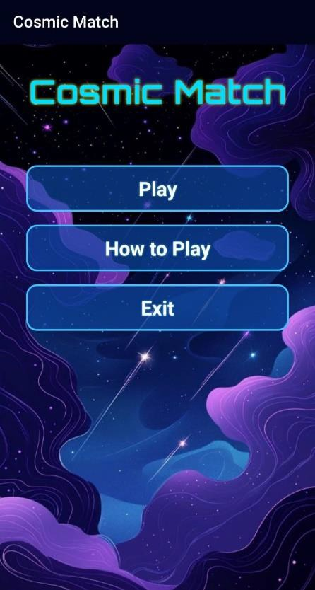
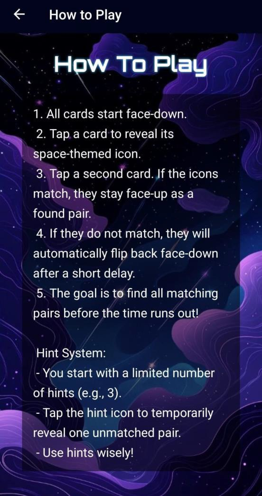
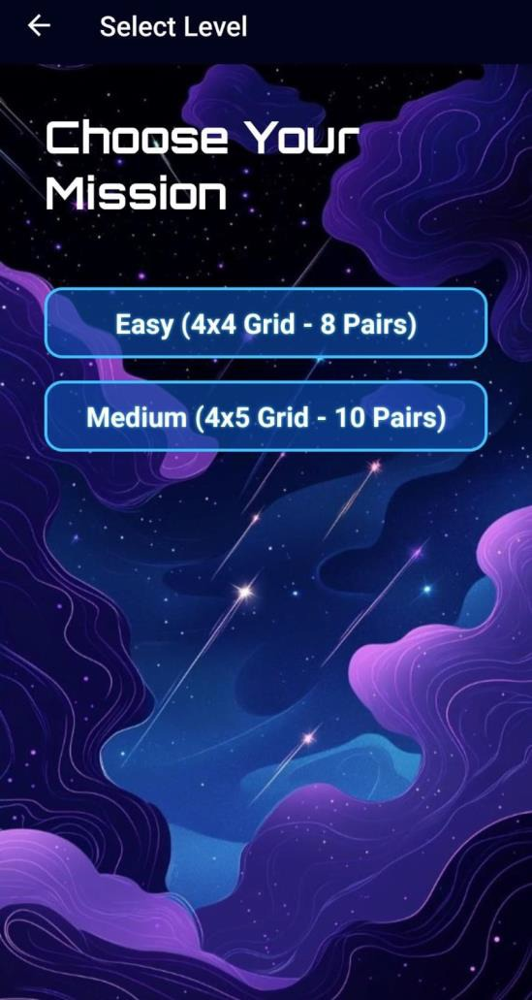
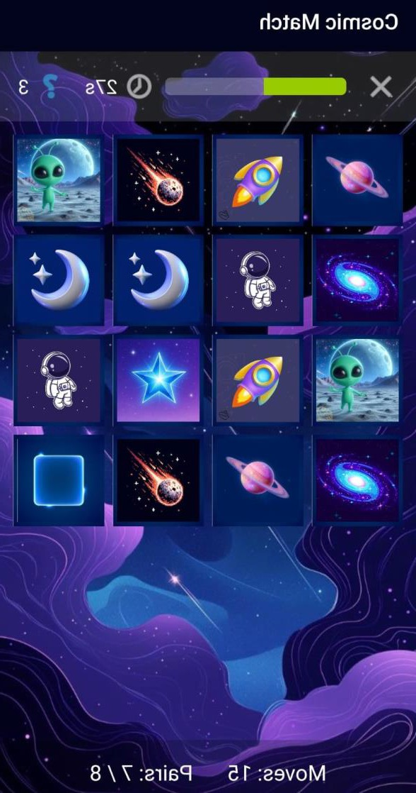
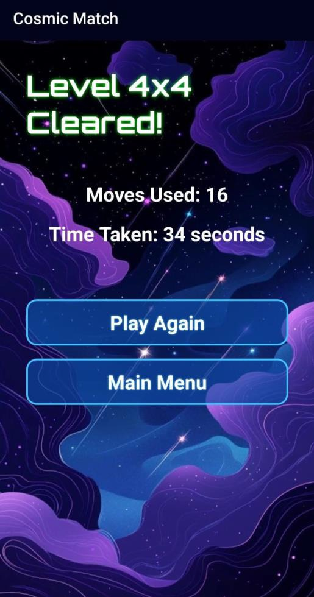

# CosmicMatch — Space-Themed Memory Game  

<p align="center">
  
  
  
  
</p>

<p align="center">
🌌A fast-paced, visually striking memory matching game built using Kotlin🌌
</p>

---

## 🌟About the Project  

**CosmicMatch** is a space-themed **Memory Matching Card Game** developed for Android using **Kotlin** and traditional **XML layouts** in Android Studio.  

The game challenges players to match identical space-themed cards (rockets, planets, stars, etc.) within a limited time. With multiple difficulty levels, a hint system, and a neon sci-fi aesthetic, CosmicMatch offers a fun and engaging brain-training experience.

This project was built to strengthen **Android fundamentals**, including **game logic, UI design, activity navigation, and time-based state management**.

---

## 🚀Features  

✤**Classic Memory Matching Gameplay** – Match all pairs before time runs out  
✤**Countdown Timer** – Visualized using a shrinking progress bar  
✤**Multiple Difficulty Levels** – Easy (4×4), Medium (4×5)  
✤**Hint System** – Limited hints to assist players  
✤**Move Tracking** – Displays number of moves used  
✤**Win/Lose Result Screen** – Detailed performance stats  
✤**Neon Sci-Fi UI Theme** – Custom fonts & space visuals  
✤**Smooth Card Animations** – Controlled flip logic  

---

## 🛠Tech Stack  

| Category | Technology |
|--------|------------|
| 💻 Language | Kotlin |
| 📱 Platform | Android |
| 🎨 UI Design | XML Layouts |
| 🧩 Architecture | Multi-Activity (MVC-style) |
| ⏱ Time Handling | CountDownTimer |
| 🔄 UI Binding | View Binding |
| 🧪 Testing | Android Emulator/Physical Device |

---

## 🧠App Architecture  

CosmicMatch follows a **multi-activity architecture** with clear separation of responsibilities:

UI (XML Layouts)<br>
↓<br>
Activities (Game Logic & Navigation)<br>
↓<br>
Data Classes (MemoryCard)<br>
↓<br>
Adapters (RecyclerView CardAdapter)

✤Clean navigation flow  
✤Easy to maintain and extend  
✤Efficient game state management  

---

## 📱App Screens  

📌Screenshots captured directly from the CosmicMatch Android application

<p align="center">
  <b>⏳Splash Screen</b>&nbsp;&nbsp;&nbsp;
  <b>🏠Home Screen</b>&nbsp;&nbsp;&nbsp;
  <b>🎮Instruction Screen</b>
</p>

<p align="center">
  
  
  
</p>

<p align="center">
  <b>🃏Game Mode Screen</b>&nbsp;&nbsp;&nbsp;
  <b>🏆Card Match Screen</b>
  <b>🎮Result Screen</b>
</p>

<p align="center">
  
  
  
</p>

---

## ⚙️System Requirements  

- **Android Studio**: Latest stable version  
- **Kotlin**: 1.9.0 or higher  
- **Minimum SDK**: API 24 (Android 7.0)  
- **Test Device**: Emulator or Physical Android Device  

---

## ▶️How to Run the Project  

1. Clone the repository:
   ```bash
   git clone https://github.com/saxena-693/CosmicMatch-Android-Game.git
2. Open the project in Android Studio
3. Let Gradle sync complete
4. Run the app on:<br>
   ✤Emulator <br>
   ✤Physical Android device <br>

---

## 🔮Future Enhancements

✤Online leaderboards(Firebase / Play Games Services) <br>
✤Additional themes(Deep Sea, Ancient Ruins, etc.) <br>
✤Custom grid sizes & difficulty settings <br>
✤Sound effects & background music <br>
✤Improved animations & transitions <br>

---
## 👩‍💻Author
Nandini Saxena <br>
🎓B.Tech (Computer Science & Engineering) <br>
💡Passionate about Android & Game Development <br>

<p align="center">✨If you like this project, don’t forget to star the repository💙</p> 
